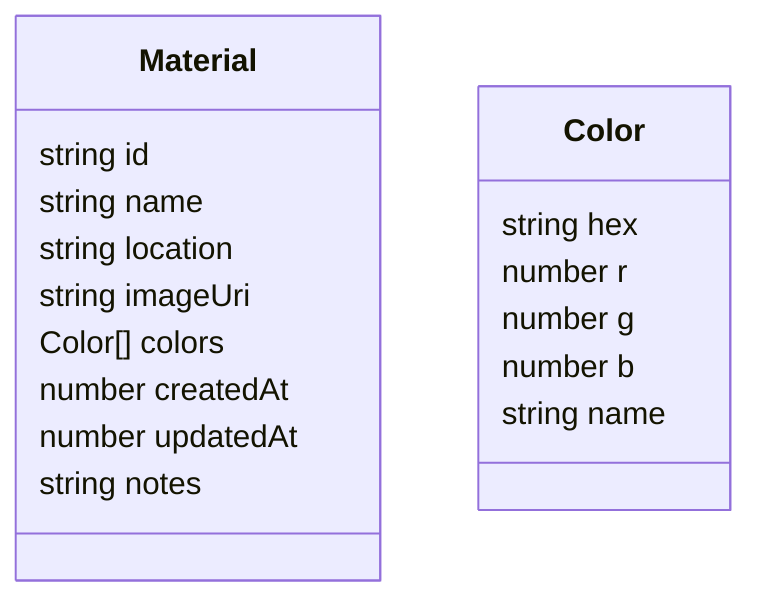

# Data Model Details

- `id`: UUID v4
- `colors`: up to 5 dominant colors per image. `name` is a human/AI label when available.

## SQLite Schema (Initial)
- materials(id TEXT PRIMARY KEY, name TEXT, location TEXT, imageUri TEXT, colors TEXT, createdAt INTEGER, updatedAt INTEGER, notes TEXT)

`colors` stored as JSON string for simplicity.
